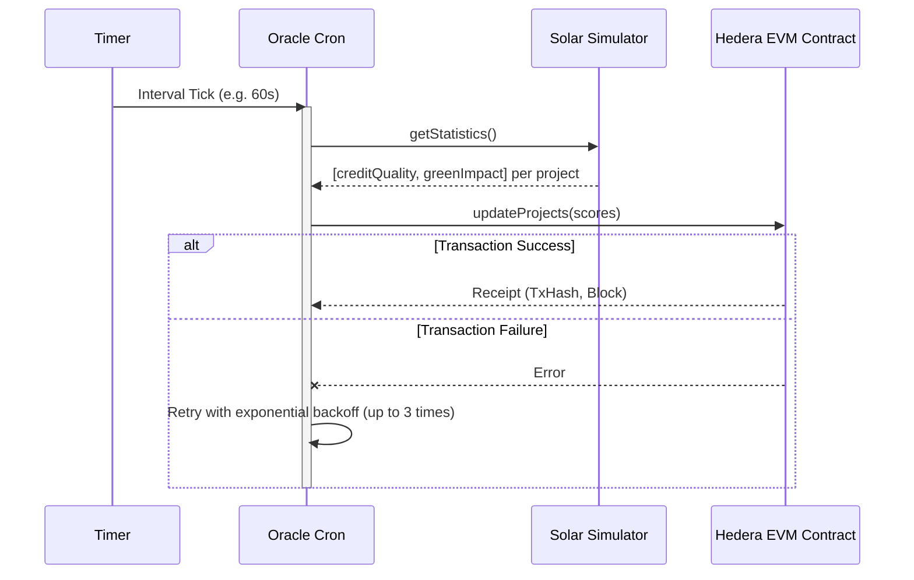

# EcoBond Backend

Bun/Express backend for eco monitoring demos, including:

- Solar farm IoT simulator
- Satellite imagery AI simulator
- Structured app logging (Winston + Morgan)

## Tech Stack

- Bun
- Express
- CORS
- dotenv
- Winston
- Morgan

## Quick Start

```bash
bun install
bun run dev
```

Server default:

- `http://localhost:5000`

Health check:

- `GET /health`

## Scripts

- `bun run dev` - Start with bun --watch
- `bun start` - Start with Bun


## Environment Variables

Create a `.env` file (optional):

```env
PORT=5000
NODE_ENV=development
LOG_LEVEL=info
```

## API Base Paths

- `/api/solar`
- `/api/satellite`

All endpoints return JSON. Most success responses use:

```json
{
  "success": true,
  "data": {}
}
```

## Endpoints

### Health

- `GET /health` - Returns `{ "message": "Server is running" }`


### Solar Simulator API

- `GET /api/solar/devices` - List all devices
- `POST /api/solar/devices` - Add device
- `GET /api/solar/readings` - Current readings for all devices
- `GET /api/solar/devices/:deviceId/reading` - Reading for one device
- `GET /api/solar/devices/:deviceId/history?limit=100` - Device history
- `GET /api/solar/statistics/:deviceId` - Stats for one device
- `GET /api/solar/statistics` - Stats for all devices
- `PATCH /api/solar/devices/:deviceId/status` - Set online/offline state

Important behavior:

- `deviceId` is treated as a positive integer by the simulator.
- In-memory history is capped at 1000 readings.
- Data resets when the server restarts.

Example add device:

```bash
curl -X POST http://localhost:5000/api/solar/devices \
  -H "Content-Type: application/json" \
  -d '{
    "deviceId": 13,
    "farmName": "Delta Solar Cooperative",
    "capacity": 550
  }'
```

Example toggle status:

```bash
curl -X PATCH http://localhost:5000/api/solar/devices/13/status \
  -H "Content-Type: application/json" \
  -d '{ "isOnline": false }'
```

### Satellite Simulator API

- `POST /api/satellite/capture` - Capture image (optional body: `region`)
- `GET /api/satellite/regions` - Available regions + capture count
- `GET /api/satellite/analysis/forest-density?region=...&limit=10`
- `GET /api/satellite/analysis/ndvi/:region?limit=10`
- `GET /api/satellite/analysis/deforestation/:region?days=30`
- `GET /api/satellite/analysis/carbon/:region`
- `GET /api/satellite/metadata/:imageId`

Important behavior:

- Analysis endpoints use captured in-memory images.
- Some results can be empty or return insufficient-data style responses until you capture images first.
- Data resets when the server restarts.

Example capture image:

```bash
curl -X POST http://localhost:5000/api/satellite/capture \
  -H "Content-Type: application/json" \
  -d '{ "region": "Amazon Basin" }'
```

Example forest-density analysis:

```bash
curl "http://localhost:5000/api/satellite/analysis/forest-density?region=Amazon%20Basin&limit=5"
```

## Oracle Cron Service

The backend includes a built-in periodic Oracle service that reads simulated data from the IoT simulators and pushes impact scores to an on-chain Hedera EVM smart contract (`ProjectMod.sol`).

By default, the cron runs every 60 seconds (configurable via `ORACLE_UPDATE_INTERVAL_MS`). It includes resilient retry logic with exponential backoff to handle transient RPC or network issues.

### Data Flow



### Cron Management Endpoints

- `GET /api/oracle/cron/status` - View cron status, run history, and last transaction hash
- `POST /api/oracle/cron/start` - Manually start the cron loop
- `POST /api/oracle/cron/stop` - Manually stop the cron loop

## Logging

Log files are created in `logs/`:

- `logs/combined.log` - All app logs
- `logs/error.log` - Error logs only

`morgan` request logs are routed through the same Winston logger.

## Project Structure

```text
ecoBond-backend/
|- controllers/
|  |- itemController.js
|  |- satelliteController.js
| EcoBond CRE workflows for Chainlink: a TypeScript-based automation project for configuring, simulating, and running scheduled on-chain/off-chain bond operations acro `- solarController.js
|- models/
|  `- Item.js
|- routes/
|  |- items.js
|  |- satellite.js
|  `- solar.js
|- simulators/
|  |- SatelliteImageryAI.js
|  `- SolarFarmSimulator.js
|- utils/
|  |- logger.js
|  `- morgan.js
|- logs/
|- API_GUIDE.md
|- SIMULATOR_SUMMARY.md
|- index.js
`- package.json
```

## Notes

- Storage is currently in-memory only.
- This backend is best suited for demo/prototyping unless persistence and tests are added.
- For expanded endpoint walkthroughs, see `API_GUIDE.md`.
